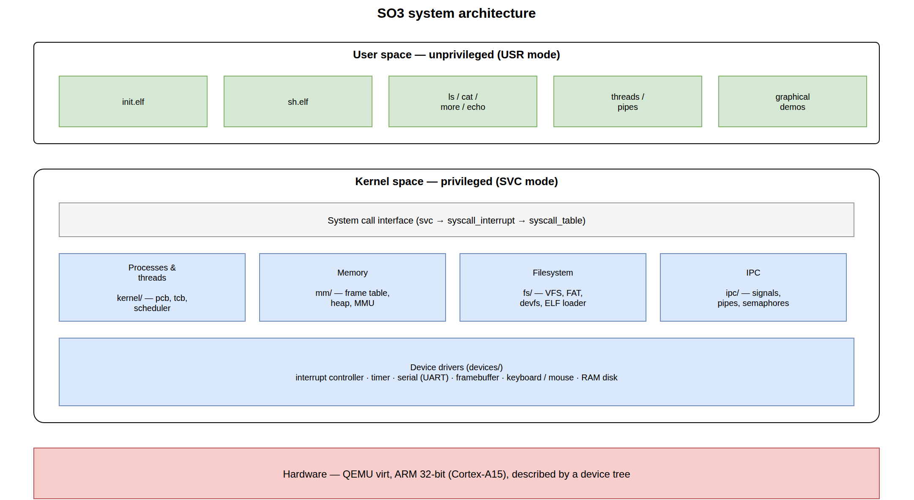
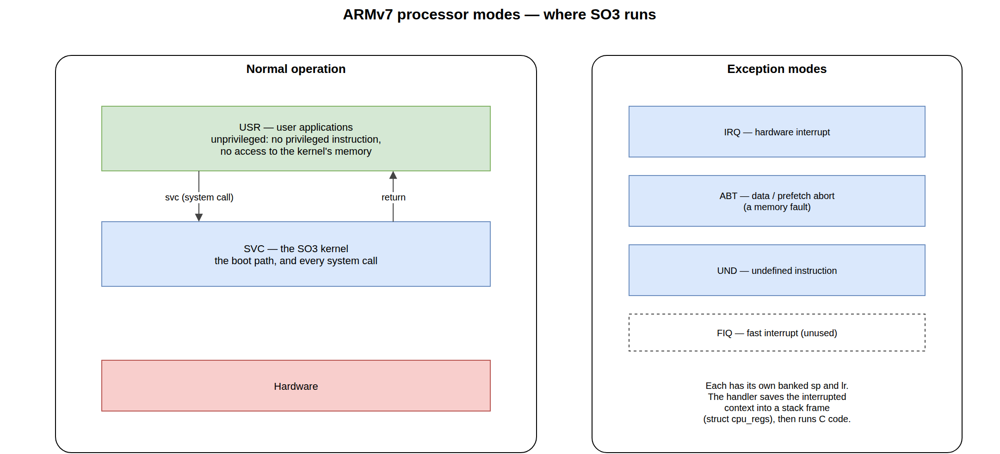
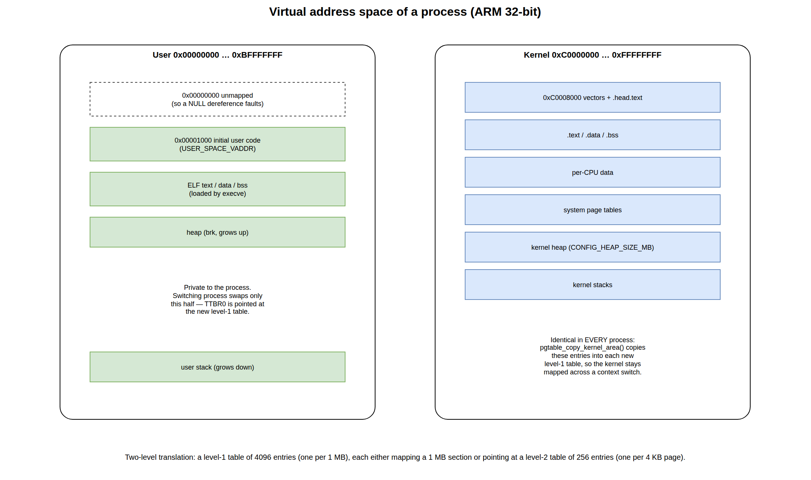
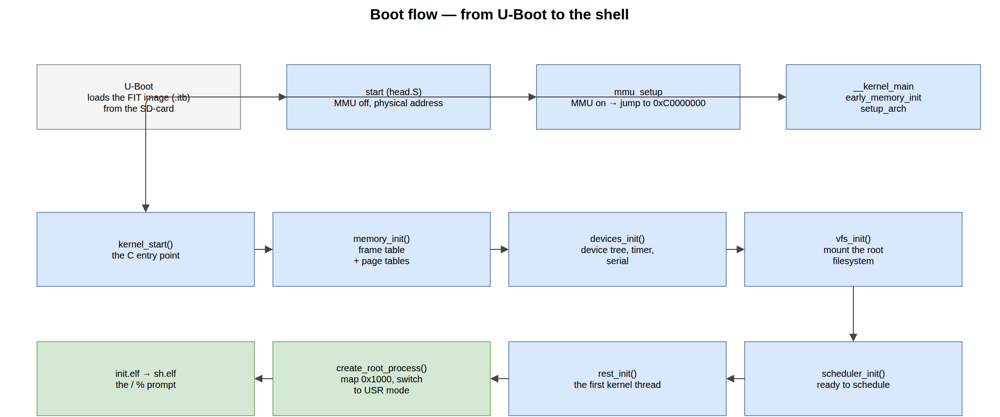

.. _architecture:

================
SO3 architecture
================

SO3 follows a conventional operating-system organisation with a **user space**
and a **kernel space**. It is a *monolithic* kernel, like Linux: all subsystems
and device drivers live inside the kernel.

   Overview of the SO3 system.

The user space is a small set of applications (``init``, the shell, ``ls``,
``cat``, ``more``, …) built against the **MUSL** C library and stored in a root
filesystem. The kernel provides the usual subsystems — process and thread
management, scheduling, memory management, a virtual filesystem, IPC — plus the
device drivers.

The separation is enforced by the hardware, and this is the point of the whole
exercise: user code runs **unprivileged**, cannot execute privileged
instructions, and cannot even name the kernel's memory. The only way in is a
**system call** (:ref:`kernel`).

Source tree
===========

The kernel source lives under ``so3/so3/`` and is organised by subsystem::

   so3/so3/
   ├── arch/         # architecture-specific code
   │   └── arm32/    #   boot, exception vectors, MMU, context switch
   ├── kernel/       # processes, threads, scheduler, syscalls, time
   ├── mm/           # page frame allocator, kernel heap
   ├── fs/           # VFS, FAT, devfs, ELF loader
   ├── ipc/          # signals, pipes, semaphores, completions
   ├── devices/      # device drivers (timer, serial, framebuffer, …)
   ├── dts/          # device trees (*.dts → *.dtb)
   ├── include/      # kernel headers
   ├── configs/      # defconfig files
   └── lib/          # in-kernel helper libraries

.. note::

   Kernel paths are quoted **relative to that tree** throughout this
   documentation: ``kernel/process.c`` means ``so3/so3/kernel/process.c``.

The user space lives under ``so3/usr/`` (see :ref:`user_space`) and the
surrounding tooling — build system, bootloader, emulator, root filesystem — at
the repository root (:ref:`build_system`).

Privilege levels
================

ARMv7 does not have "kernel mode" and "user mode" so much as a set of
**processor modes**, each with its own banked stack pointer and link register.
SO3 uses them like this:

   Processor modes and what runs in each.

.. flat-table::
   :header-rows: 1
   :widths: 20 22 58

   * - Mode
     - CPSR ``M[4:0]``
     - What runs there
   * - **USR**
     - ``0b10000``
     - user applications — unprivileged
   * - **SVC**
     - ``0b10011``
     - the kernel: the boot path, and every system call
   * - **IRQ**
     - ``0b10010``
     - interrupt handlers, on entry
   * - **ABT** / **UND**
     - ``0b10111`` / ``0b11011``
     - memory faults (data/prefetch abort) and undefined instructions

A user program leaving USR mode is always an *event*: it executes ``svc``
(a system call), it takes an interrupt, or it faults. Each of those enters the
kernel through the **exception vector table** (``__vectors``,
``arch/arm32/exception.S``) — eight entries, one per exception type, whose
addresses the kernel installs in the ``VBAR`` register at boot:

.. flat-table::
   :header-rows: 1
   :widths: 34 66

   * - Vector
     - Handler
   * - undefined instruction
     - ``undefined_instruction``
   * - **software interrupt (``svc``)**
     - ``syscall_interrupt`` — the system-call path
   * - prefetch abort / data abort
     - ``prefetch_abort`` / ``data_abort`` — memory faults
   * - **IRQ** / FIQ
     - ``irq`` / ``fiq`` — hardware interrupts

Each handler starts by saving the interrupted context (the registers, ``CPSR``,
and the banked ``sp``/``lr`` of USR mode) into a **stack frame** on the kernel
stack, so that the kernel can run C code and later restore the user program
exactly where it was. That frame is ``struct cpu_regs``; the offsets assembly
uses to reach its fields are generated by ``arch/arm32/asm-offsets.c``.

Virtual address space
=====================

Each process owns a **private page table**, and the MMU translates every address
the processor emits through it.

   The virtual address space of a process.

On ARMv7 with the short-descriptor format the translation has **two levels**:

* a **level-1 table** of 4096 entries, one per 1 MB of virtual address space
  (16 KB per table). An entry either maps a 1 MB *section* directly, or points
  at a level-2 table;
* a **level-2 table** of 256 entries, one per 4 KB *page*.

The split between user and kernel is a pure convention on the address, fixed by
``CONFIG_KERNEL_VADDR``:

.. flat-table::
   :header-rows: 1
   :widths: 34 66

   * - Range
     - Contents
   * - ``0x00001000`` … ``0xBFFFFFFF``
     - **user** — the process's code, data, heap and stack. The first user page
       (``USER_SPACE_VADDR = 0x1000``) is where the initial user code is mapped;
       address ``0`` is deliberately left unmapped so a NULL dereference faults.
   * - ``0xC0000000`` … ``0xFFFFFFFF``
     - **kernel** — the kernel image, the per-CPU data, the page tables, the
       kernel heap (``CONFIG_HEAP_SIZE_MB``) and the kernel stacks.

Both halves live in the **same** level-1 table, and the register ``TTBR0`` points
at the table of the running process. That is why every process's table contains
the same kernel entries: ``pgtable_copy_kernel_area()`` (``arch/arm32/mmu.c``)
copies them in when the table is created. Switching process therefore only
changes the user half — the kernel stays mapped, at the same addresses, all the
time. It is what makes a system call cheap: no address space to rebuild, just a
change of privilege.

The macros ``__pa()`` / ``__va()`` (``include/memory.h``) convert between a
kernel virtual address and a physical one, using ``CONFIG_KERNEL_VADDR`` and the
physical base of RAM discovered from the device tree.

Boot flow
=========

SO3 is started by **U-Boot**, which loads a **FIT image** (``.itb``) containing
the kernel, the device-tree blob and the root filesystem.

   From U-Boot to the shell prompt.

#. **U-Boot** loads the FIT image from the SD-card and jumps to the kernel entry
   point ``__start`` (``arch/arm32/head.S``).
#. The kernel is still running with the MMU **off**, at its physical load
   address. ``mmu_setup`` builds a first, coarse page table, enables the MMU and
   jumps to the kernel's *virtual* address at ``0xC0000000``.
#. ``__kernel_main`` calls ``early_memory_init()`` and ``setup_arch()``, then
   branches into C proper: ``kernel_start()`` (``kernel/main.c``).
#. ``kernel_start()`` brings the system up in order: ``memory_init()`` (frame
   table + final page tables), ``devices_init()`` (device-tree probe, timer,
   serial), ``timer_init()``, ``vfs_init()`` (mount the root filesystem),
   ``scheduler_init()``, then ``calibrate_delay()`` and the first kernel thread.
#. That thread, ``rest_init()``, calls ``create_root_process()``, which maps a
   small trampoline at ``0x1000``, switches to USR mode and runs it.
#. The trampoline immediately ``execve()``\ s ``init.elf`` — the *SO3 Init
   Program* — which in turn launches the shell ``sh.elf``. You get the prompt::

      / %

The individual subsystems are described in :ref:`kernel`; the packaging of the
FIT image and the U-Boot/QEMU setup are covered in :ref:`build_system` and
:ref:`running`.
