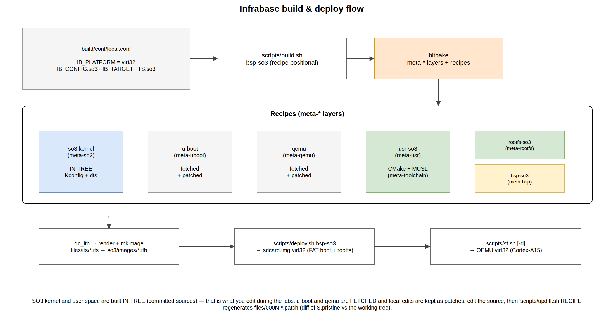

.. _build_system:

============
Build system
============

The tree is built with **Infrabase**, a thin orchestration layer on top of
`bitbake <https://docs.yoctoproject.org/bitbake/>`__. A set of *meta-layers*
(``build/meta*``) provides the recipes; a single configuration file
(``build/conf/local.conf``) selects *what* to build; and a handful of wrapper
scripts in ``scripts/`` drive the whole thing — building the kernel, the user
space, U-Boot and the root filesystem, assembling the FIT image, then packaging
it onto a virtual SD-card.

   From ``local.conf`` through the meta-layer recipes to a bootable image.

The SO3 **kernel** and **user space** are built *in tree*, directly from the
committed ``so3/`` sources — that is where your work happens. The other
components, **U-Boot** and **QEMU**, are *fetched* from upstream and local
changes are kept as patches (see :ref:`fetched components <fetched_components>`).

In practice you will not see them fetched at all: the :ref:`build container
<container>` ships both already built, and the build only falls back to
fetching when you ask for one explicitly with ``build.sh -x uboot`` or
``build.sh -x qemu``.

Prerequisites
=============

None on your machine: everything the build needs lives in the
:ref:`build container <container>`. Prefix a command with ``dbuild.sh``, or open
a shell in the container and work there:

.. code-block:: console

   $ dbuild.sh build.sh bsp-so3
   $ dbuild.sh                       # ... or an interactive shell
   [sye-build] ~/sye/sye_student $ build.sh bsp-so3

Building natively is possible but you have to provide the environment yourself:
the bitbake host dependencies, the image tooling (``device-tree-compiler``,
``u-boot-tools``, ``mtools``, ``dosfstools``, ``parted``, the QEMU build
dependencies) and two cross toolchains — ``arm-none-eabi-`` for the kernel and
``arm-linux-gnueabihf-`` for U-Boot. The canonical, continuously tested list is
``docker/build-env/packages.txt``.

.. note::

   The MUSL user-space toolchain is produced into the bitbake work tree by the
   ``meta-toolchain`` layer; there is no manual step for it, in the container or
   out of it.

Getting started
===============

Everything is anchored on the repository root. Source ``env.sh`` once per shell:

.. code-block:: console

   $ . ./env.sh

This exports ``IB_ROOT_DIR``, sets ``BBPATH``/``BUILDDIR`` to ``build/``, and
prepends ``scripts/`` and the bundled ``bitbake`` to ``PATH`` so the active tree
wins. From then on ``build.sh`` / ``deploy.sh`` / ``st.sh`` / ``dbuild.sh`` are
on the path. See :ref:`getting_started` for the end-to-end walkthrough.

Meta-layers
===========

.. flat-table::
   :header-rows: 1
   :widths: 24 76

   * - Layer
     - Provides
   * - ``meta``
     - base bitbake classes — notably ``patch.bbclass`` (the fetch/patch/``updiff``
       machinery) and the privileged-helper plumbing.
   * - ``meta-so3``
     - the **SO3 kernel** recipe (``so3_<version>.bb``, built in tree), pinned by
       ``PREFERRED_VERSION_so3``.
   * - ``meta-usr``
     - the **user space** (``usr-so3``, CMake + MUSL toolchain): a committed
       lvgl-free base, plus the opt-in ``:lvgl`` override (LVGL, ``slv`` and the
       graphical demos) layered as patches.
   * - ``meta-bsp``
     - **board support**: ``bsp-so3`` assembles the FIT image (``do_itb``) and
       writes the boot media (``do_deploy_boot``).
   * - ``meta-uboot``
     - the **U-Boot** bootloader (fetched + patched).
   * - ``meta-qemu``
     - the patched **QEMU** emulator — the ``virt`` machine with the PL111
       display, the PL050 keyboard and the absolute pointer the stock model does
       not have.
   * - ``meta-rootfs``
     - builds the **root filesystem** image.
   * - ``meta-toolchain``
     - builds the **MUSL** cross-toolchain used by the user space.
   * - ``meta-filesystem``
     - creates and populates the **SD-card image** (privileged ``losetup``/
       ``mkfs``/``mount`` via ``sudo -n``).

``build/conf/bblayers.conf`` is regenerated automatically from this fixed list;
do not edit it by hand.

.. note::

   ``build/`` also carries layers for components this course does not use —
   Linux, the AVZ hypervisor, ARM Trusted Firmware — and the recipes know about
   64-bit platforms this tree never builds. All of it is inert as long as you
   build ``bsp-so3`` on ``virt32``; ignore it.

Configuration — ``build/conf/local.conf``
=========================================

A few ``IB_*`` variables select the target and what is built for it:

.. flat-table::
   :header-rows: 1
   :widths: 34 66

   * - Variable
     - Meaning
   * - ``IB_PLATFORM``
     - target platform — ``virt32``, and nothing else in this tree.
   * - ``IB_CONFIG:so3:virt32``
     - the SO3 kernel ``defconfig`` — ``virt32_fb_defconfig``, which enables the
       framebuffer and input devices.
   * - ``IB_TARGET_ITS:so3:virt32``
     - the **FIT image** template to assemble — ``virt32_so3``.
   * - ``IB_BUILD_QEMU``
     - build the patched QEMU along with the BSP when no emulator is
       available yet (``1`` by default). Inside the container there is nothing
       to do — it ships one under ``/opt/qemu``. Set to ``0`` for a build-only
       setup that never runs the emulator.
   * - ``IB_STORAGE_MODE:virt32``
     - ``soft`` — the SD-card is a plain image file under ``filesystem/``.

The build & deploy scripts
==========================

``build.sh`` runs bitbake to *build* artefacts:

.. flat-table::
   :header-rows: 1
   :widths: 18 82

   * - Option
     - Action
   * - ``<recipe>`` (or ``-x <recipe>``)
     - build a recipe and its dependency tree. The **BSP** name ``bsp-so3``
       pulls everything (kernel + user space + rootfs + FIT — U-Boot too, when
       it is not already provided by the container); a
       **component** (``so3``, ``usr-so3``, ``uboot``, ``qemu``, ``filesystem``,
       …) builds just itself. ``-x`` is optional. The ``sudo -n`` session is
       opened automatically for recipes that need root at build time
       (``filesystem``).
   * - ``-c``
     - **clean** the recipe first, then rebuild.
   * - ``-l`` / ``-v``
     - **list** all recipes / **verbose** bitbake output.

``deploy.sh`` then *writes the boot media* (and opens the ``sudo -n`` session the
privileged tasks need): ``deploy.sh <recipe>`` deploys it — the BSP writes the
whole image (rootfs + FIT/ITB), a component (e.g. ``usr-so3``) deploys just its
part. ``-l`` / ``-v`` list / verbose. Deploy does **not** recompile: it consumes
what ``build.sh`` already produced, so the workflow is always *edit → build.sh →
deploy.sh*. A deploy with no prior build fails clearly rather than silently
rebuilding.

.. important::

   ``build.sh bsp-so3`` compiles the BSP but does **not** create the SD-card
   image: the empty ``filesystem/sdcard.img.virt32`` is produced by the separate,
   privileged ``filesystem`` recipe (``losetup``/``mkfs``/``parted``).
   ``deploy.sh`` populates and writes that image but does not create it, so a
   deploy against a fresh tree fails until the image exists. The canonical
   first-build sequence is therefore three steps::

      build.sh bsp-so3        # compile kernel + user space + rootfs + FIT
      build.sh -x filesystem  # create + format the SD-card image (privileged, once)
      deploy.sh bsp-so3       # populate the rootfs and write the boot media

   Once the image exists, later edits only need ``build.sh -x <recipe>`` +
   ``deploy.sh bsp-so3`` — the ``filesystem`` step is a one-off.

Fast edit/build loops
=====================

A full ``bsp-so3`` build is rarely what you want.

Most of the time the answer is ``makeso3.sh``: it rebuilds the kernel and the
user space, then deploys, in one command and from any directory in the tree.

.. code-block:: console

   $ makeso3.sh            # kernel + user space + deploy
   $ makeso3.sh -k         # kernel only
   $ makeso3.sh -u         # user space only
   $ makeso3.sh -n         # build, do not deploy

It builds both halves directly — ``make`` and ``cmake``, no bitbake — so the
loop stays short, and it delegates the deployment to ``deploy.sh`` because
packing the FIT image and writing the SD-card is recipe work.

When you want to drive a single recipe yourself, the mapping is:

.. flat-table::
   :header-rows: 1
   :widths: 30 70

   * - You edited
     - Run
   * - the **kernel** (``so3/so3/``)
     - ``build.sh -x so3`` then ``deploy.sh bsp-so3``
   * - a **user application** (``so3/usr/src/``)
     - ``build.sh -x usr-so3`` then ``deploy.sh bsp-so3``
   * - a **device tree** (``so3/so3/dts/``)
     - ``build.sh -x so3`` then ``deploy.sh bsp-so3``
   * - **U-Boot** or **QEMU**
     - ``build.sh -x uboot`` / ``build.sh -x qemu`` (QEMU needs no deploy)

.. important::

   The SO3 kernel is built *in tree*, and bitbake does not track the in-tree
   ``so3/so3/so3.bin`` as a task output. After rebuilding the kernel
   (``build.sh -x so3``), run ``deploy.sh bsp-so3`` to regenerate the FIT
   image and refresh the SD-card — otherwise you boot the *previous* kernel.
   This is the mistake ``makeso3.sh`` exists to prevent: it always deploys
   unless you tell it not to with ``-n``.

The SO3 kernel recipe
=====================

``so3_<version>.bb`` configures and builds the kernel straight from ``so3/so3``;
the mechanics below are the familiar Kbuild ones.

Configuration (Kconfig)
-----------------------

Each subsystem carries a ``Kconfig``; every option becomes a ``CONFIG_*`` symbol
stored in ``so3/so3/.config`` and exposed as ``include/generated/autoconf.h``.
``IB_CONFIG:so3:virt32`` names the ``defconfig`` (``so3/so3/configs/``) the
recipe loads, and the target architecture (``CONFIG_VIRT32``) is driven from
``.config``. ``menuconfig`` is available for interactive tweaks.

Linker script and asm-offsets
-----------------------------

The kernel is linked with an architecture-specific script
(``arch/arm32/so3.lds``) that places the exception vectors, ``.head.text``, the
code/data/bss, the per-CPU area, the system page tables, the driver *initcall*
sections, the heap and the per-CPU stacks. Sizes come from ``CONFIG_*`` symbols
passed with ``--defsym``; the base address is ``CONFIG_KERNEL_VADDR``. Assembly
needs the byte offsets of C structures — ``arch/arm32/asm-offsets.c`` produces a
header of ``#define OFFSET_*`` values shared by C and assembly, exactly as Linux
does.

Device trees
------------

Hardware is described by **device trees** in ``so3/so3/dts/``. The ``.dts``
sources are compiled to ``.dtb`` blobs and shipped to the kernel inside the FIT
image; the kernel parses the blob at boot to discover RAM and devices. The QEMU
``virt`` nodes for the framebuffer and input devices live here too.

FIT image and boot media
========================

SO3 is started by **U-Boot**, which loads a **FIT image** (``.itb``) — a single
file bundling the kernel, its device tree and the root filesystem. The ``.its``
*templates* live in the BSP layer (``meta-bsp/recipes-bsp/so3/files/its/``) and
reference the component trees through ``${IB_*_PATH}`` placeholders. The
``do_itb`` task **renders** the template into the gitignored output directory
``so3/images/`` — expanding ``${IB_SO3_PATH}`` and ``${IB_ROOTFS_PATH}`` to
absolute paths — then assembles the ``.itb`` there with ``mkimage``:

.. flat-table::
   :header-rows: 1
   :widths: 34 66

   * - ``.its`` template
     - Contents
   * - ``virt32_so3.its``
     - the course image: SO3 kernel + DTB + ramfs

``do_deploy_boot`` then writes the resulting ``virt32_so3.itb`` from
``so3/images/`` into the FAT (boot) partition of
``filesystem/sdcard.img.virt32``.

.. _fetched_components:

Working with fetched components (``updiff``)
============================================

U-Boot and QEMU are *fetched* from upstream into the repository root
(``u-boot/``, ``qemu/`` — git-ignored) and patched. Local changes are kept as a
numbered patch series, regenerated with **updiff** rather than edited by hand:

#. Edit the working tree directly (e.g. ``qemu/hw/arm/virt.c``).
#. Build to test (``build.sh -x qemu``).
#. Regenerate the patches: ``updiff.sh qemu``.

``updiff`` (``patch.bbclass``) diffs the pristine upstream snapshot
(``${S}.pristine``, taken right after fetch) against the working tree and writes
one git-style patch per changed file into
``build/meta-<c>/recipes-<c>/<c>/files/000N-*.patch``, consolidating in place and
regenerating the ``…-patches.inc`` manifest.

.. note::

   The SO3 **kernel** and **user space** are versioned in the repository, so they
   carry *no* patch series — you simply edit and rebuild them. This is the case
   for everything you touch during the labs.

User space and toolchain
========================

The user-space applications in ``so3/usr/src/`` are built with **CMake** against
the **MUSL** C library. Adding a C file means adding it to the relevant
``CMakeLists.txt``, then:

.. code-block:: console

   $ build.sh -x usr-so3
   $ deploy.sh bsp-so3

The MUSL cross-toolchain (``arm-linux-musleabihf``) is produced by
``meta-toolchain`` into the bitbake work tree — there is no manual toolchain
step.
