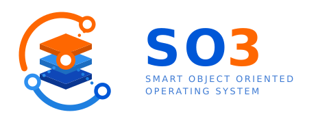

.. SYE documentation master file.

.. toctree::
   :maxdepth: 2
   :numbered:
   :hidden:
   :caption: Working with the tree

   getting_started
   container
   build_system
   running
   troubleshooting

.. toctree::
   :maxdepth: 2
   :numbered:
   :hidden:
   :caption: The SO3 operating system

   introduction
   architecture
   kernel
   user_space
   debugging

.. toctree::
   :maxdepth: 1
   :hidden:
   :caption: Laboratoires

   labs

==========================================
Welcome to SYE — Systèmes d'exploitation
==========================================

This is the working documentation of the **SYE** course (*Systèmes
d'exploitation*) at the `REDS Institute <http://reds.heig-vd.ch/en/rad>`__,
HEIG-VD. It documents **the tree you work in**: how the build system is
organised, how to build, deploy and run the system, and what to do when it does
not work.

The course studies an operating system from the inside — processes and threads,
scheduling, the system-call boundary, memory management, filesystems and
inter-process communication — by reading, modifying and running one that is
small enough to fit in your head. That system is **SO3**.

One target, all the way through: **virt32** — QEMU's ``virt`` machine, ARM
32-bit (Cortex-A15).

.. list-table::
   :header-rows: 1
   :widths: 26 74

   * - What
     - Where
   * - The machine
     - QEMU ``virt``, ARM 32-bit, Cortex-A15, 4 cores, 1 GB of RAM
   * - The boot chain
     - U-Boot loads a FIT image from a virtual SD-card
   * - The screen
     - a PL111 framebuffer and PS/2-style input, in a QEMU window

It is emulated, so nothing can go wrong that a rebuild does not fix, and the
whole machine — kernel, user space, bootloader — is yours to inspect and change.
Everything in this documentation assumes ``IB_PLATFORM = "virt32"``.

Where to start
==============

:ref:`Getting started <getting_started>`
    Get the tree, build the container, and boot your first system. Start here.

:ref:`Build container <container>`
    ``dbuild.sh`` — every toolchain and host package the build needs, without
    installing anything on your machine.

:ref:`Build system <build_system>`
    The Infrabase build system: layers, recipes, ``local.conf``, ``build.sh``,
    ``deploy.sh``, and the fast edit/build loops.

:ref:`Running <running>`
    QEMU (headless and graphical), the shell, and debugging the kernel and your
    applications with GDB.

:ref:`Troubleshooting <troubleshooting>`
    The errors you are most likely to hit, and what they actually mean.

:ref:`Introduction to SO3 <introduction>` · :ref:`Architecture <architecture>`
    What the system is, how it is split between user and kernel, and how it
    boots.

:ref:`Kernel internals <kernel>` · :ref:`User space <user_space>`
    The subsystems the labs modify — memory, processes, threads, scheduling,
    system calls, IPC, the filesystem — and the applications above them.

:ref:`Debugging <debugging>`
    Stopping the machine and looking inside, from GDB or from VSCode.

.. _about_so3:

About SO3
=========

**SO3** (*Smart Object Oriented*) is the compact operating system developed at
the REDS Institute and used throughout this course. It has a real user/kernel
separation, an MMU, a scheduler, a virtual filesystem and IPC — and it is still
small enough that you can read the part you are working on in an afternoon.

The chapters under *The SO3 operating system* cover it as this course uses it:
**standalone, on a 32-bit ARM machine**. They stay at the level the labs need —
what a mechanism is, where its code lives, and what happens when you change it.

For anything beyond that — the 64-bit port, the full driver model, the graphics
and network stacks, and the AVZ hypervisor and SO3 capsules of the SOO research
framework — the reference is upstream:

    👉 https://smartobjectoriented.github.io/so3

.. note::

   AVZ and the capsules are **not** part of this course. If you meet them in the
   source tree or in the upstream documentation, you can safely skip them.

Conventions
===========

Commands are shown as you would type them **from the root of the tree**, with
the build environment loaded:

.. code-block:: console

   $ cd sye_student
   $ . ./env.sh
   $ build.sh -l

A ``$`` prompt is your machine; a ``[sye-build]`` prompt is a shell inside the
build container:

.. code-block:: console

   [sye-build] ~/sye/sye_student $ build.sh bsp-so3

Acknowledgements
================

SYE builds on the **SO3** operating system and the **Infrabase** build system,
both developed at the REDS Institute of HEIG-VD. Our thanks to everyone —
teachers, assistants and students — whose reports, patches and questions keep
this material honest.
