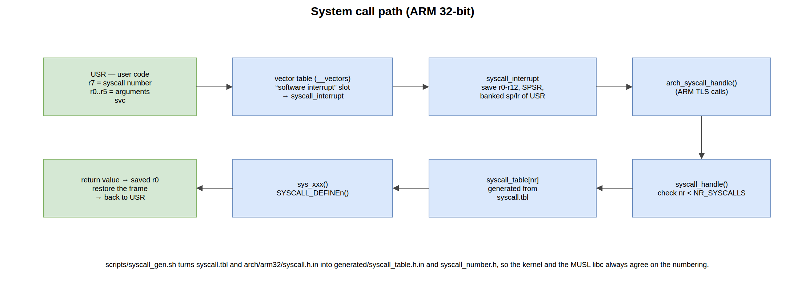

.. _kernel:

================
Kernel internals
================

This chapter walks through the kernel subsystems you will read and modify during
the labs. Everything below describes the ARM 32-bit (``arch/arm32``) port in its
standalone configuration.

Memory management
=================

Physical memory: the frame table
--------------------------------

Physical memory is tracked by a **frame table** (``mm/memory.c``): one entry per
physical page, recording whether the page is free and how many mappings refer to
it. How much RAM there is, and where it starts, comes from the device tree at
boot (``get_mem_info()``).

``get_free_page()`` hands out a free physical page; a page goes back to the pool
when its reference count drops to zero. This is the bottom of the memory stack:
everything else — a process's page tables, its stack, the pages backing a
``malloc()`` in the kernel — is ultimately a frame taken from here.

Kernel heap
-----------

Dynamic kernel allocations use a **quick-fit** heap (``mm/heap.c``), sized by
``CONFIG_HEAP_SIZE_MB`` (8 MB in the course configuration) and reserved by the
linker script. ``malloc()`` / ``free()`` inside the kernel operate on it; chunks
carry a small header and are kept on free lists by size.

Page tables
-----------

The page tables are built in ``arch/arm32/mmu.c``. The central function is
``create_mapping()``: given a page table, a virtual address, a physical address
and a size, it installs the translation, allocating the level-2 table if the
level-1 entry does not have one yet, and choosing a 1 MB *section* or 4 KB
*pages* according to alignment and size.

The two-level layout, the ``0xC0000000`` split and the per-process table are
described in :ref:`architecture`. The functions worth knowing:

.. flat-table::
   :header-rows: 1
   :widths: 38 62

   * - Function
     - Role
   * - ``create_mapping()``
     - install a virtual → physical mapping in a page table
   * - ``release_mapping()``
     - remove one, freeing the level-2 tables it emptied
   * - ``pgtable_copy_kernel_area()``
     - copy the kernel half into a freshly created process table
   * - ``mmu_switch()``
     - point ``TTBR0`` at another process's table (and flush the TLB)

Threads and scheduling
======================

The unit of execution is a **thread**, described by a *Task Control Block*
(``tcb_t``, ``include/thread.h``): a thread id, a priority, a state, a saved CPU
context (``cpu_regs_t``) and a stack. Threads are either **kernel threads**
(``kernel_thread()``) or **user threads** (``user_thread()``) belonging to a
process.

A thread is always in exactly one state:

.. flat-table::
   :header-rows: 1
   :widths: 24 76

   * - State
     - Meaning
   * - ``THREAD_STATE_NEW``
     - created, not yet runnable
   * - ``THREAD_STATE_READY``
     - runnable, waiting for the CPU
   * - ``THREAD_STATE_RUNNING``
     - on the CPU right now
   * - ``THREAD_STATE_WAITING``
     - blocked — on a completion, a semaphore, a pipe, a ``waitpid()``
   * - ``THREAD_STATE_ZOMBIE``
     - finished, waiting to be reaped

The scheduler lives in ``kernel/schedule.c``. The default policy is
**round-robin** (``CONFIG_SCHED_RR``) with preemption on the timer tick
(``CONFIG_SCHED_FREQ_PREEMPTION``); a **fixed-priority** policy
(``CONFIG_SCHED_PRIO``) is also available, and switching between the two is a
matter of the kernel configuration.

``schedule()`` picks the next runnable thread and calls ``__switch_to()``
(``arch/arm32/context.S``). The context switch itself is short and worth reading
once: it saves the callee-saved registers of the outgoing thread into its TCB,
restores those of the incoming one, and returns — into the *other* thread.

Processes
=========

A **process** (``pcb_t``, ``include/process.h``) owns an address space (its
level-1 page table), a heap, a table of file descriptors, a current working
directory and one or more threads. The usual pair creates them:

* ``fork()`` duplicates the calling process — a new PCB, a new page table, and a
  copy of the parent's user mappings. The child returns ``0``, the parent gets
  the child's pid.
* ``execve()`` replaces the current process's image with a program loaded from
  the filesystem: the old user mappings are dropped, the ELF file is parsed and
  its loadable segments are mapped in, and execution restarts at its entry point.

ELF binaries are parsed and loaded by ``fs/elf.c``: ``elf_load_buffer()`` reads
the file through the VFS, then the loadable segments are mapped into the
process's address space.

The very first process is a special case, built by ``create_root_process()``
(``kernel/process.c``). It maps a compiled-in trampoline (``__root_proc``,
``arch/arm32/context.S``) at ``USER_SPACE_VADDR`` (``0x1000``) and starts a user
thread there; the trampoline immediately calls ``execve("init.elf")``, so the
first *real* program is init.

System calls
============

This is the boundary the whole course turns around, so it is worth following
end to end.

   From the user program to the kernel function and back.

A user program issues the ``svc`` instruction. Following the ARM EABI, the
**system-call number is in r7** and the arguments in **r0–r5**.

#. ``svc`` switches the processor to **SVC mode** and jumps to the *software
   interrupt* slot of the vector table, i.e. ``syscall_interrupt``
   (``arch/arm32/exception.S``).
#. That handler builds the stack frame: it saves ``r0``–``r12``, the return
   address, the ``SPSR`` (the user program's ``CPSR``) and the banked USR-mode
   ``sp``/``lr``. This is what will be restored on the way out.
#. It re-enables interrupts and calls ``arch_syscall_handle()``
   (``arch/arm32/syscalls.c``), which handles the two ARM-specific TLS calls and
   otherwise forwards to ``syscall_handle()`` (``kernel/syscalls.c``).
#. ``syscall_handle()`` checks the number against ``NR_SYSCALLS`` and calls
   ``syscall_table[syscall_no]``.
#. The return value is written back into the saved ``r0`` of the stack frame, the
   frame is popped and the processor returns to USR mode — the user program sees
   the value as the return of its libc wrapper.

The dispatch table is **generated at build time**, so that the kernel and the
MUSL libc can never disagree on a number. ``scripts/syscall_gen.sh`` reads two
inputs:

.. flat-table::
   :header-rows: 1
   :widths: 30 70

   * - Input
     - Contents
   * - ``syscall.tbl``
     - the SO3 table: one line per system call — *MUSL name*, *kernel function*,
       and an optional configuration requirement. A call deliberately left out
       is mapped to ``empty``, which returns ``-ENOSYS``.
   * - ``arch/arm32/syscall.h.in``
     - the system-call **numbers** for this architecture — a copy of the same
       file from MUSL.

and produces ``generated/syscall_number.h`` and
``generated/syscall_table.h.in``, the latter being included straight into the
``syscall_table[]`` definition. Each kernel-side implementation is a
``sys_xxx()`` function declared with the ``SYSCALL_DEFINEn()`` macros
(``include/syscall.h``).

.. tip::

   Adding a system call therefore means: write the ``sys_xxx()`` function,
   declare it with ``SYSCALL_DEFINEn``, add its line to ``syscall.tbl``, and call
   it from user space through the MUSL wrapper. Nothing has to be renumbered by
   hand.

Inter-process communication
===========================

``ipc/`` provides the mechanisms user programs use to talk to each other:

* **signals** (``signal.c``) — POSIX-like signals, checked on the way back to
  user space. ``kill()`` posts a signal; ``rt_sigaction()`` installs a handler;
  a pending signal makes the kernel build a second stack frame so the user
  handler runs in USR mode, and ``sigreturn`` unwinds it.
* **pipes** (``pipe.c``) — in-kernel FIFOs, with blocking read and write. A
  reader on an empty pipe waits; a writer on a full one waits; closing the write
  end makes the reader see end-of-file. This is what the shell's ``|`` uses.
* **semaphores** (``semaphore.c``) and **completions** (``completion.c``) — the
  kernel's own synchronisation primitives, also used internally by the drivers
  and the scheduler.

Virtual filesystem
==================

The **VFS** (``fs/vfs.c``) keeps a global table of open files; each process maps
its own descriptors (``pcb->fd_array``) onto entries in that table. That
indirection is exactly what makes ``dup2()``, redirection and inheritance across
``fork()`` work.

An operation on a descriptor is dispatched to the filesystem that owns the file.
The kernel registers two:

* **FAT** (``fs/fat/``) — the root filesystem, which in the course configuration
  is a RAM disk (``CONFIG_ROOTFS_RAMDEV``) unpacked from the FIT image at boot;
* **devfs** (``fs/devfs/``) — a virtual filesystem exposing the registered
  devices under ``/dev``.

``vfs_init()`` runs early in ``kernel_start()`` and mounts these before the root
process starts.

Interrupts and time
===================

A hardware interrupt enters through the **IRQ** vector, which saves the
interrupted context exactly like the system-call path does, then calls the
kernel's interrupt dispatcher. The dispatcher asks the interrupt controller
which line fired, looks it up in its table, and calls the handler that was
registered for it.

Registering one is a single call (``include/device/irq.h``):

.. code-block:: c

   irq_return_t my_handler(int irq, void *data)
   {
       /* acknowledge the device, do the short work here */
       return IRQ_COMPLETED;
   }

   irq_bind(MY_IRQ, my_handler, NULL, my_data);

The third argument is an optional **deferred** function: work too long to run
with interrupts disabled is handed to it and executed later, outside the
interrupt context — the same idea as Linux's top half / bottom half.
``irq_unbind()`` removes the handler.

Time comes from the ARM generic timer (``devices/timer/arm_timer.c``). Its
periodic tick — ``CONFIG_HZ``, 100 Hz here — is what drives the scheduler:
each tick charges the running thread and, when its slice is over, marks that a
reschedule is due. ``calibrate_delay()``, run once during bring-up, measures how
many loop iterations fit in a tick so that ``udelay()`` can busy-wait accurately.
